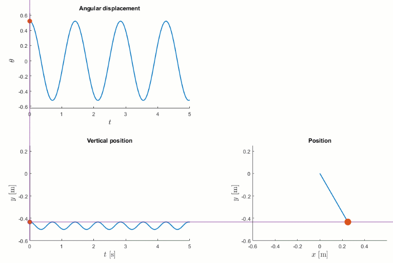
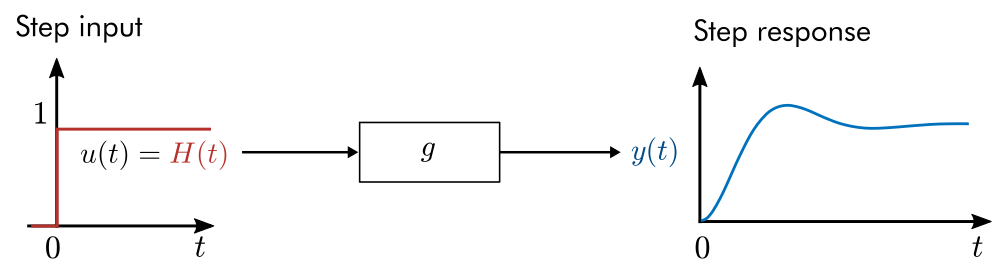
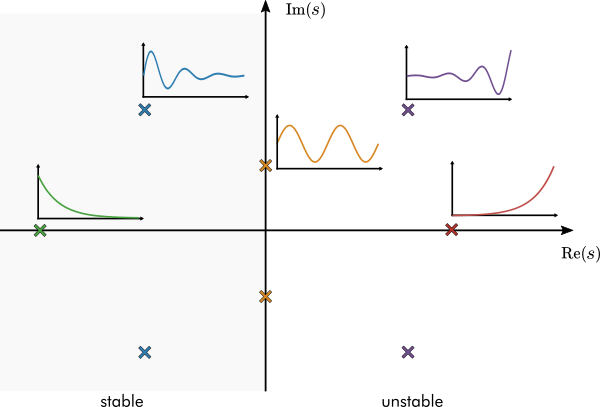
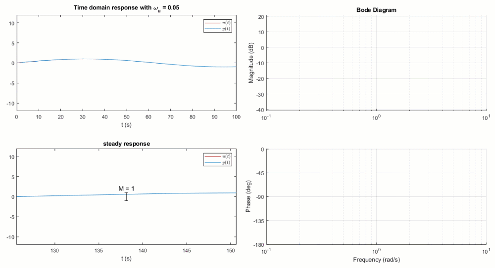
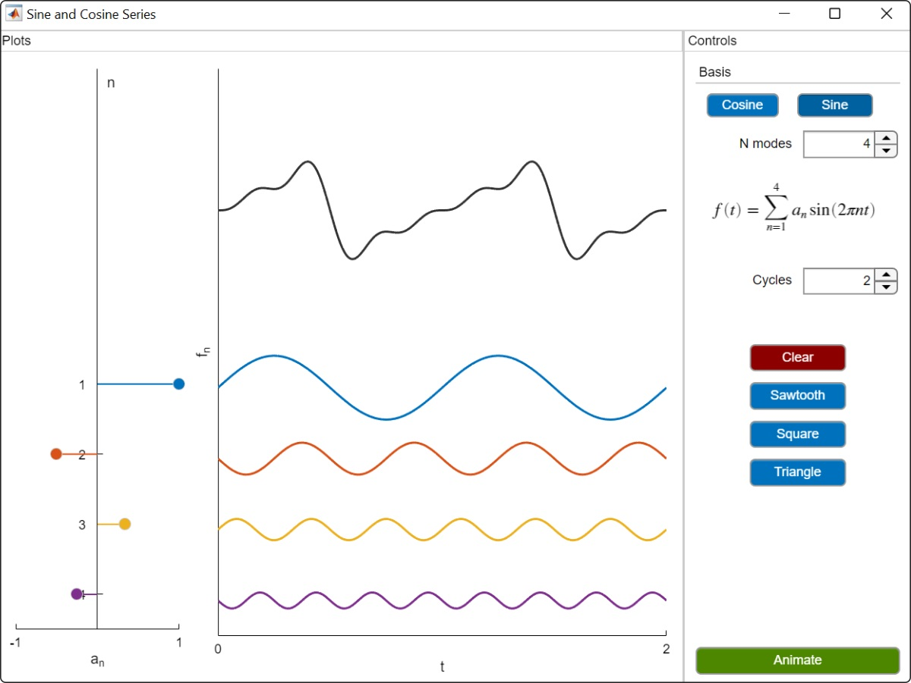
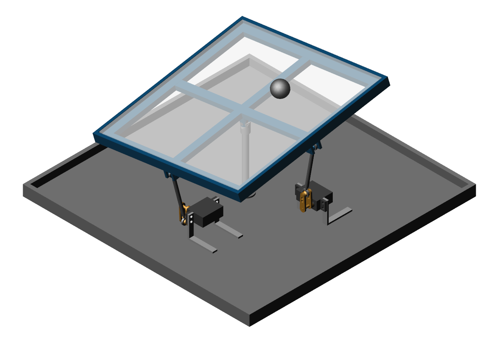

# Transfer Function Analysis of Dynamic Systems

 or 

**Curriculum Module**

_Created with R2020b. Compatible with R2020b and later releases._

# Information

This curriculum module contains interactive [MATLAB® live scripts](https://www.mathworks.com/products/matlab/live-editor.html) and [apps](https://www.mathworks.com/products/matlab/app-designer.html) that teach transfer function analysis of dynamic systems.

## Background

You can use these live scripts as demonstrations in lectures, class activities, or interactive assignments outside class. In the first script, students learn to derive transfer functions from ODEs and compute impulse, step, and forced responses. In subsequent scripts, students perform pole-zero and frequency domain analyses. Throughout the module, students apply transfer functions to analyze the dynamics of physical and electrical systems. In the final lesson, students perform a frequency domain analysis of an LC filter in a buck converter. A review of Laplace transforms is also included for students seeking a refresher. In addition, there is a MATLAB app that lets you construct a transfer function by graphically positioning the poles and zeros. You can also compute and plot the impulse and step responses.

The instructions inside the live scripts will guide you through the exercises and activities. Get started with each live script by running it one section at a time. To stop running the script or a section midway (for example, when an animation is in progress), use the  Stop button in the **RUN** section of the **Live Editor** tab in the MATLAB Toolstrip.

## Contact Us

Solutions are available upon instructor request. Contact the [MathWorks teaching resources team](mailto:onlineteaching@mathworks.com) if you would like to request solutions, provide feedback, or if you have a question.

## Prerequisites

This module assumes knowledge of algebra and differential equations. There is minimal MATLAB knowledge required for these scripts and app, but you could use [MATLAB Onramp](https://matlabacademy.mathworks.com/details/matlab-onramp/gettingstarted) and [Introduction to Symbolic Math with MATLAB](https://matlabacademy.mathworks.com/details/introduction-to-symbolic-math-with-matlab/symbolic) as a resource to acquire familiarity with MATLAB syntax, live scripts, and apps.

## Getting Started
### Accessing the Module
### **On MATLAB Online:**

Use the  link to download the module. You will be prompted to log in or create a MathWorks account. The project will be loaded, and you will see an app with several navigation options to get you started.

### **On Desktop:**

Download or clone this repository. Open MATLAB, navigate to the folder containing these scripts and double-click on [TransferFunctions.prj](https://matlab.mathworks.com/open/github/v1?repo=MathWorks-Teaching-Resources/Transfer-Function-Analysis-of-Dynamic-Systems&project=TransferFunctions.prj). It will add the appropriate files to your MATLAB path and open an app that asks you where you would like to start. 

Ensure you have all the required products ([listed below](#H_E850B4FF)) installed. If you need to include a product, add it using the Add-On Explorer. To install an add-on, go to the **Home** tab and select   **Add-Ons** > **Get Add-Ons**. 

## Products

 *MATLAB* is used throughout. Tools from *Symbolic Math Toolbox™ and Control System Toolbox™* are used frequently as well.

# Scripts

 *If you are viewing this in a version of MATLAB prior to R2023b, you can view the learning outcomes for each script* [*here*](https://www.mathworks.com/matlabcentral/fileexchange/94635-transfer-function-analysis-of-dynamic-systems)

## [**ConceptReview.mlx**](https://matlab.mathworks.com/open/github/v1?repo=MathWorks-Teaching-Resources/Transfer-Function-Analysis-of-Dynamic-Systems&project=TransferFunctions.prj&file=ConceptReview.mlx)
|  | **In this script, students will...** | **Academic disciplines**  |
| :-- | :-- | :-- |
|  | • Compute Laplace transforms by hand and using symbolic math  • Describe the properties of the Laplace transform  • Apply Laplace transforms to solve initial value problems  • Recall the definition of a linear time-invariant (LTI) operator | • Mechanical Engineering  • Electrical Engineering  • Mathematics  |

## [**TransferFunctionBasics.mlx**](https://matlab.mathworks.com/open/github/v1?repo=MathWorks-Teaching-Resources/Transfer-Function-Analysis-of-Dynamic-Systems&project=TransferFunctions.prj&file=TransferFunctionBasics.mlx)
|  | **In this script, students will...** | **Academic disciplines**  |
| :-- | :-- | :-- |
|  | • Derive transfer functions by hand  • Derive transfer functions using symbolic math  • Numerically evaluate and plot the impulse, step, and forced responses of a system  • Analytically derive the step and forced responses of a system  • Explain the physical significance of time responses | • Mechanical Engineering  • Electrical Engineering  • Mathematics  |

## [**PoleZeroAnalysis.mlx**](https://matlab.mathworks.com/open/github/v1?repo=MathWorks-Teaching-Resources/Transfer-Function-Analysis-of-Dynamic-Systems&project=TransferFunctions.prj&file=PoleZeroAnalysis.mlx)
|  | **In this script, students will...** | **Academic disciplines**  |
| :-- | :-- | :-- |
|  | • Describe how the transfer function of a DC motor is derived  • Identify the poles and zeros of a transfer function  • Assess the stability of an LTI system based on the transfer function poles  • Relate the position of poles in the s-plane to the damping and natural frequency of a system  • Explain how poles of a second-order system relate to its dynamics  • Examine how transfer function zeros affect the dynamics of a system | • Mechanical Engineering  • Electrical Engineering  • Mathematics  |

## [**FrequencyDomainAnalysis.mlx**](https://matlab.mathworks.com/open/github/v1?repo=MathWorks-Teaching-Resources/Transfer-Function-Analysis-of-Dynamic-Systems&project=TransferFunctions.prj&file=FrequencyDomainAnalysis.mlx)
|  | **In this script, students will...** | **Academic disciplines**  |
| :-- | :-- | :-- |
|  | • Explain how a Bode plot is generated  • Use MATLAB to numerically calculate the frequency response of a transfer function  • Discuss how features of the Bode plot relate to characteristics of physical systems  • Describe how to derive a differential equation model for a buck converter with an LC filter  • Apply the Bode plot to analyze an LC filter in a buck converter |  • Mechanical Engineering  • Electrical Engineering  • Mathematics  |

# License

The license for this module is available in the [LICENSE.md](https://github.com/MathWorks-Teaching-Resources/Transfer-Function-Analysis-of-Dynamic-Systems/blob/release/LICENSE.md).

# Related Courseware Modules

## [Fourier Analysis](https://www.mathworks.com/matlabcentral/fileexchange/106725-fourier-analysis?s_tid=srchtitle)
|  | **Available on:**      [GitHub](https://github.com/MathWorks-Teaching-Resources/Fourier-Analysis)   |
| :-- | :-- |

## [Virtual Hardware and Labs for Controls](https://www.mathworks.com/matlabcentral/fileexchange/100064-virtual-hardware-and-labs-for-controls?s_tid=srchtitle)
|  | **Available on:**      [GitHub](https://github.com/MathWorks-Teaching-Resources/Virtual-Controls-Laboratory)  |
| :-- | :-- |

Feel free to explore our other [modular courseware content](https://www.mathworks.com/matlabcentral/fileexchange/?q=tag%3A%22courseware+module%22&sort=downloads_desc_30d).

# Educator Resources
-  [Educator Page](https://www.mathworks.com/academia/educators.html) 

# Contribute 

Looking for more? Find an issue? Have a suggestion? Please contact the [MathWorks teaching resources team](mailto:%20onlineteaching@mathworks.com). If you want to contribute directly to this project, you can find information about how to do so in the [CONTRIBUTING.md](https://github.com/MathWorks-Teaching-Resources/Transfer-Function-Analysis-of-Dynamic-Systems/blob/release/CONTRIBUTING.md) page on GitHub.

 *©* Copyright 2023 The MathWorks™, Inc

